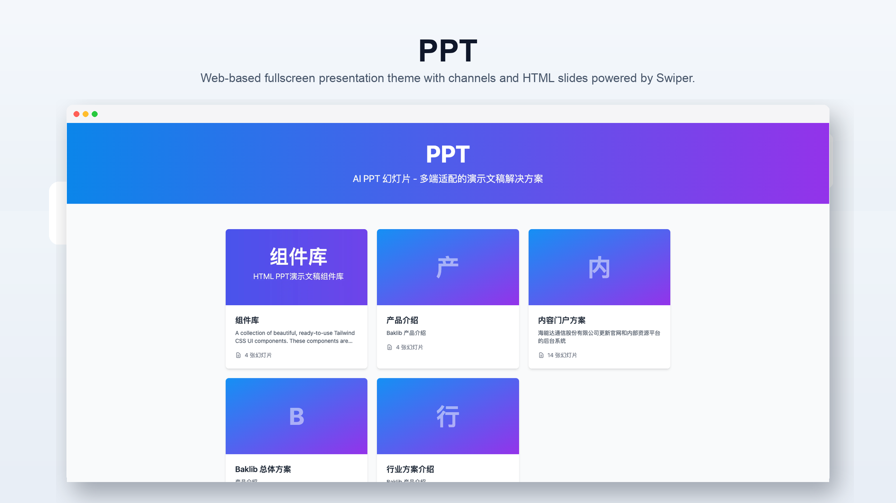
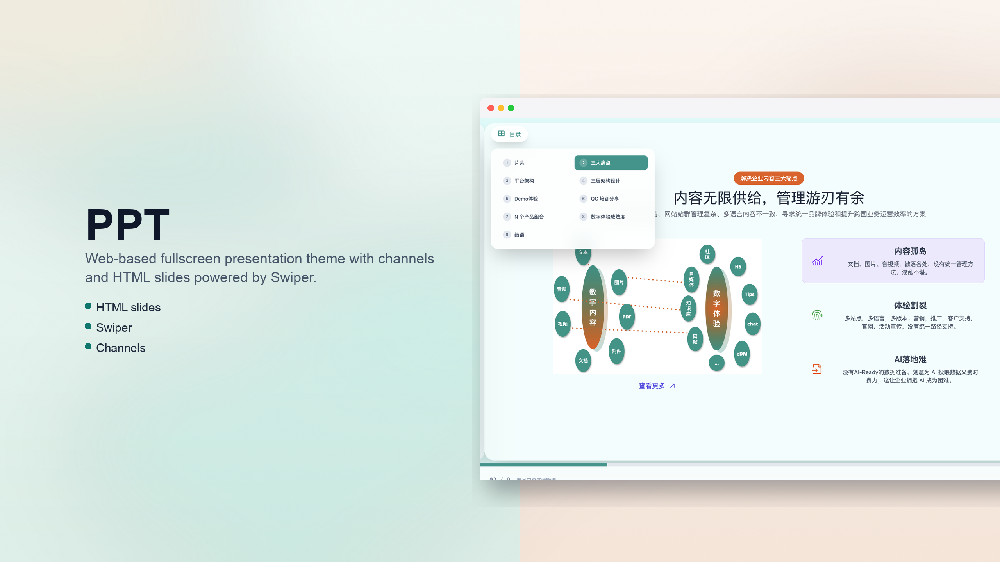
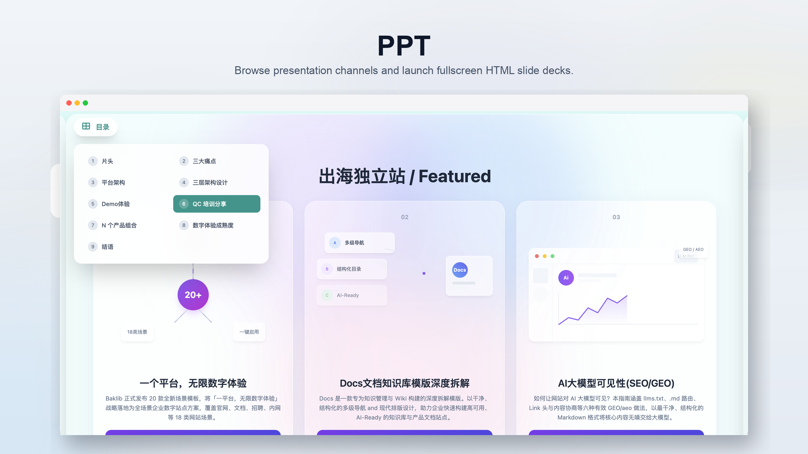

# Baklib CMS — PPT theme

A **web-based fullscreen presentation** theme for Baklib-powered sites. Build channel-based slide decks with HTML content, Swiper transitions, keyboard navigation, and responsive layouts for desktop and mobile.

Template Git URL: https://github.com/baklib-templates/ppt

---

## Features

- **Home** (`templates/index.liquid`): lists presentation channels as cards.
- **Channel** (`templates/channel.liquid`): fullscreen slide deck with Swiper, outline menu, progress bar, and prev/next controls.
- **Slide page** (`templates/page.liquid`): single-slide preview with custom HTML content.
- **Component library** (`templates/component.liquid`): reusable slide building blocks.
- Theme settings in `config/settings_schema.json`; storefront copy in `locales/*.json`; editor labels in `locales/*.schema.json`.

---

## Preview

|                 Home (channels)                  |                Cover (thumbnail)                 |
| :----------------------------------------------: | :----------------------------------------------: |
|         |        |
|              **Fullscreen channel**              |                                                  |
|    |                                                  |

---

## Installation

Find **PPT** in the Baklib template marketplace, click install, and you're ready to go.

1. Create a **channel** page under the home page using the channel template.
2. Add child **page** entries — each page is one slide with HTML content.
3. Open the channel URL to present in fullscreen with keyboard or on-screen controls.

---

## Other documents

- Chinese overview: [README.zh-CN.md](./README.zh-CN.md)
- Theme help: [www.baklib.ai/themes](https://www.baklib.ai/themes/ppt)
