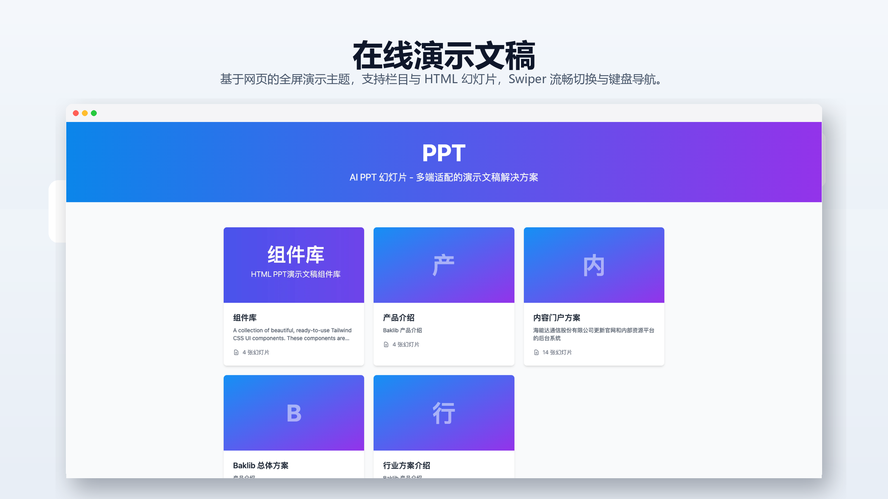
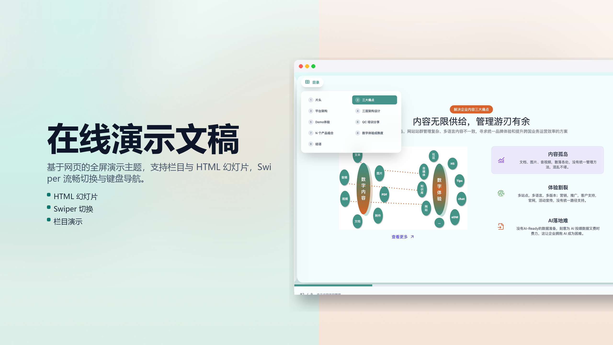

# Baklib CMS — 在线演示文稿主题（简体中文说明）

面向 Baklib 站点的 **网页全屏演示** 主题：以栏目组织幻灯片，支持 HTML 内容、Swiper 切换、键盘导航与多端适配。

模板 git 地址：https://github.com/baklib-templates/ppt

---

## 功能概览

- **首页**（`templates/index.liquid`）：以卡片形式展示所有演示栏目。
- **栏目页**（`templates/channel.liquid`）：全屏幻灯片播放，含目录菜单、进度条与上一张/下一张控制。
- **幻灯片页**（`templates/page.liquid`）：单页预览，支持自定义 HTML 内容与动画。
- **组件库**（`templates/component.liquid`）：可复用的幻灯片组件片段。
- 主题选项见 `config/settings_schema.json`；前台文案见 `locales/*.json`；后台编辑器字段标签见 `locales/*.schema.json`。

---

## 效果预览

|                 首页（栏目列表）                 |                 封面（缩略图）                 |
| :--------------------------------------------: | :--------------------------------------------: |
|    |    |
|                 **全屏栏目演示**                 |                                                |
|  |                                                |

---

## 安装教程

在 Baklib 模板市场中找到【在线演示文稿 / PPT】，点击安装即可。

1. 在首页下创建 **栏目** 页面，使用 channel 模板。
2. 在栏目下添加子 **页面**，每个子页面即一张幻灯片，填写 HTML 内容。
3. 打开栏目 URL，即可全屏演示，支持键盘方向键与底部控制栏切换。

---

## 其它文档

- 英文总览：[README.md](./README.md)
- 主题帮助：[www.baklib.com/themes](https://www.baklib.com/themes/ppt)
